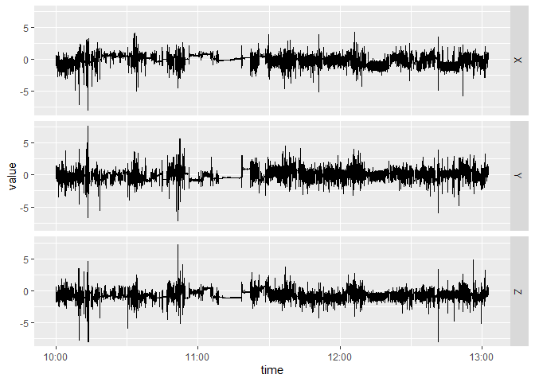
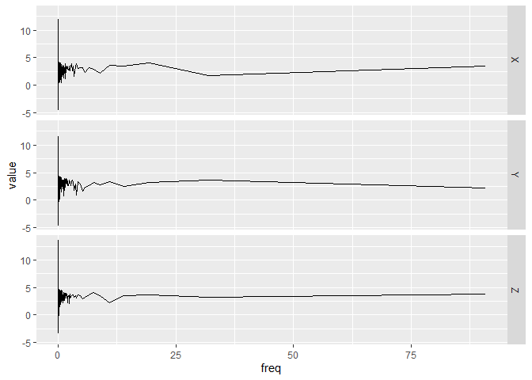

<!-- README.md is generated from README.Rmd. Please edit that file -->

# bis620.2022

<!-- badges: start -->
<!-- badges: end -->

The goal of bis620.2022 is to

1.  Capture spectral signature of Accelerometry data with three
    dimensions using Fast Fourier Transform (FFT) and also calculate
    frequency with time.

2.  Create a visualization for movements in three dimensions with time
    or frequency.

## Installation

You can install the development version of bis620.2022 from
[GitHub](https://github.com/) with:

``` r
# install.packages("devtools")
devtools::install_github("bis620.2022")
```

## Example

This is a basic example which shows you how to solve a common problem:

``` r
library(bis620.2022)
#> 载入需要的程辑包：dplyr
#> 
#> 载入程辑包：'dplyr'
#> The following objects are masked from 'package:stats':
#> 
#>     filter, lag
#> The following objects are masked from 'package:base':
#> 
#>     intersect, setdiff, setequal, union
#> 载入需要的程辑包：ggplot2
#> 载入需要的程辑包：purrr
#> 载入需要的程辑包：tidyr
## basic example code
#to get FFT of dimensions and frequency from time
data("ukb_accel")
ukb_accel |> spectral_signature()
#> # A tibble: 540,000 × 4
#>          X      Y       Z      freq
#>      <dbl>  <dbl>   <dbl>     <dbl>
#>  1  78038. 28208. 753298. 0.0000913
#>  2 153932. 98732.  53521. 0.0000913
#>  3  43385. 58240.  66251. 0.0000913
#>  4  53004. 50652.  10922. 0.0000913
#>  5  97164. 76529.  59418. 0.0000913
#>  6  30740. 49130. 101001. 0.0000913
#>  7 116648. 58509.  84698. 0.0000913
#>  8  43271. 55604.  39442. 0.0000913
#>  9  63228. 73288.  46781. 0.0000913
#> 10  56477. 17581.  70102. 0.0000913
#> # … with 539,990 more rows
#> # ℹ Use `print(n = ...)` to see more rows
#to create visualization of movement with time
ukb_accel |> accel_plot()
```



``` r
#to create visualization of logarithm transformed FFT
#movement with frequency
ukb_accel |> spectral_signature(take_log = T) |> accel_plot()
```


